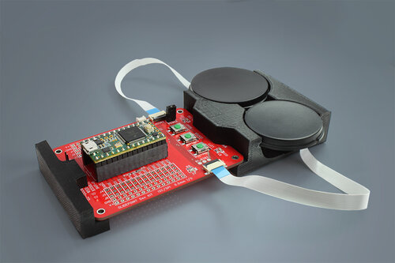

# Firmware Take Home Test

## Objective

The objective of this test it go gain an idea of your understanding of basic 
firmware development principles and get a feel for your individual coding style. You will use a circle trackpad development kit and write code that 
will run on the arduino. The arduino will run and communicate with circle 
touchpads and to fulfill the requirments below. 

## The Test

The test can be broken up into the following tasks. 

1. Determine if the circle touchpads are I2C or SPI interface
2. Determine the overlay is curved or flat
3. Clone the sample code for the correct interface and get the sample code
 building and running
4. Modify the sample code to do the following:
    1. Imagine the sensor is divided into four quadrants
    2. When a touch appears in a quadrant, stays in that quadrant, and leaves within 300 msec then report a "tap in a quadrant" by printing to the serial port Qx. Where X is the quadrant number (0..3).
5. Send the code in for review

## Helpful Links

You can use any text editor you want, but the Arduino IDE will be able to build
and update firmware on the Teensy when you are ready to test. You will need to 
install Arduino IDE and the Teensyduino software to be able to build and run the
project. 

* [Arduino IDE](https://www.arduino.cc/en/software)
* [Teensyduino](https://www.pjrc.com/teensy/td_download.html)
* [Demo Kit Git Repo](https://github.com/cirque-corp/Cirque_Pinnacle_1CA027)
* [Cirque Circle Trackpad Development Kit](https://www.cirque.com/circle-trackpad-dev-kit)
